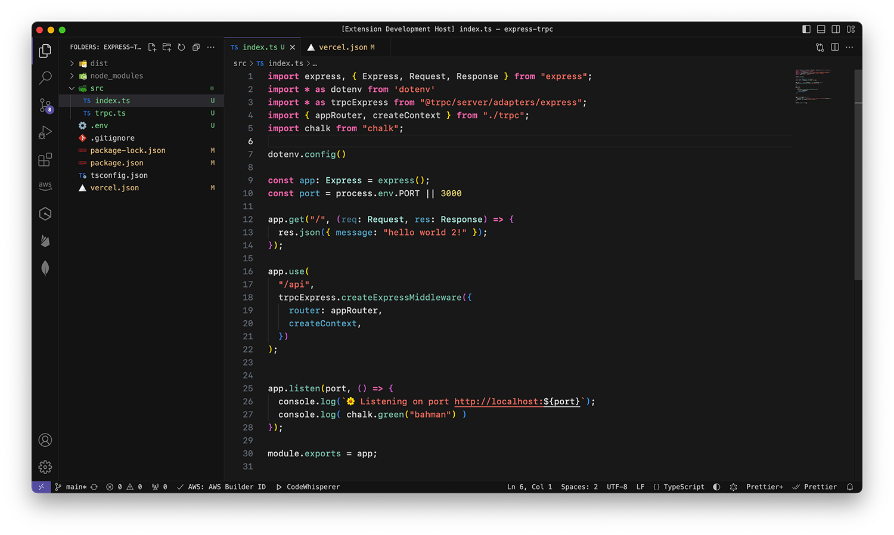
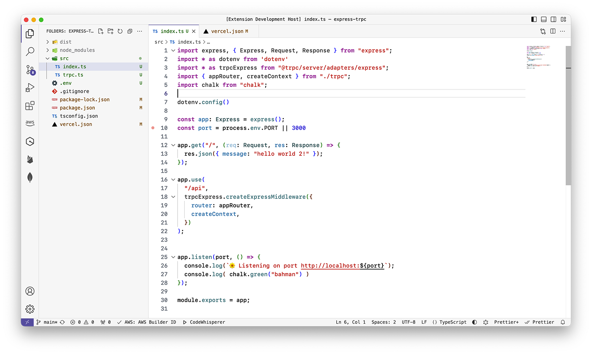
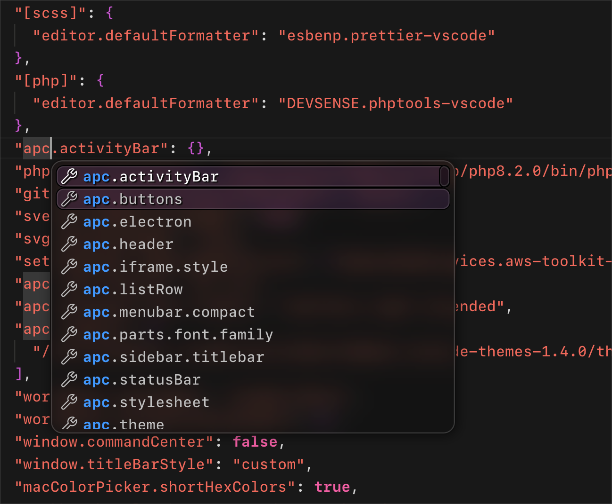

# Content Table

- [Screenshots](#screenshots)
- [Extra Widgets](#extra-widgets)

 

# Screenshots
### 🎆 Dark Theme
 

### 🌅 Light Theme

 
 

# Extra Widgets
### 🍷 Glassy Suggest-Widget

**How to Install:**

1. Install [Apc Customize UI++](https://marketplace.visualstudio.com/items?itemName=drcika.apc-extension) extension 

2. <kbd>F1</kbd> → Apc: Enable Apc Extension
 
3. `Enable widget`
 
<kbd>F1</kbd> → VSXCode: Enable Glassy Sugesst Widget 

4. `Disable widget`
 
<kbd>F1</kbd> → VSXCode: Disable Glassy Sugesst Widget