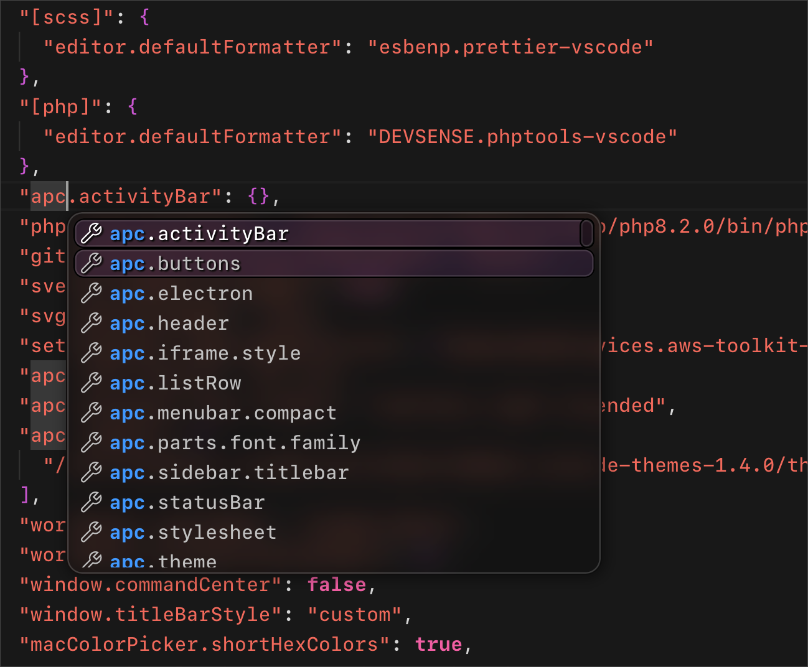

# Content Table

- [Screenshots](#screenshots)
- [Enable Glassy Widgets](#enable-glassy-widgets)

 

## Screenshots
### 🎆 Dark Theme
 

### 🌅 Light Theme

 

## Enable Glassy Widgets
### 🍷 Screenshot

**How to Install:**

1 . Install [Apc Customize UI++](https://marketplace.visualstudio.com/items?itemName=drcika.apc-extension) extension 

2 . <kbd>F1</kbd> → Enable Apc Extension
 
3 . Then use following commands:

 - **Enable Widget**:
<kbd>F1</kbd> → VSXCode: Enable Glassy Widgets

- **Disable Widget**:
<kbd>F1</kbd> → VSXCode: Disable Glassy Widgets